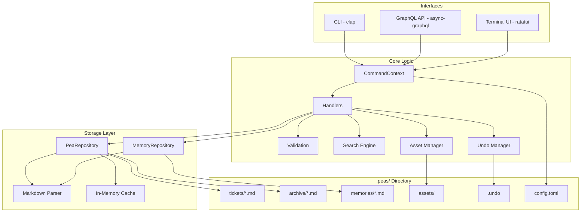
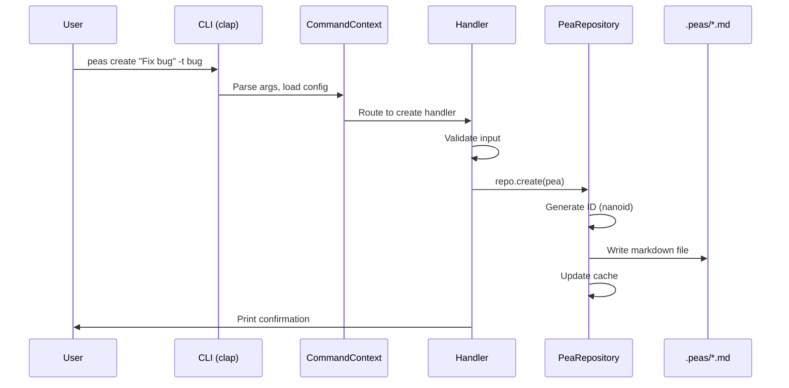

# Architecture Overview

Peas is a CLI-based, flat-file issue tracker written in Rust. It stores issues as markdown files with TOML frontmatter in a `.peas/` directory, requiring no database. It provides a CLI, GraphQL API, and interactive TUI.

## High-Level Architecture



## Data Flow



## Module Structure

```
src/
├── main.rs                  Entry point, arg parsing, routing
├── lib.rs                   Library root, module exports
├── cli/
│   ├── commands.rs          All clap command definitions (28 subcommands)
│   ├── mod.rs               CommandContext struct
│   └── handlers/            One module per subcommand
│       ├── create.rs        Create peas
│       ├── list.rs          List with filters
│       ├── update.rs        Update properties
│       ├── show.rs          Display details
│       ├── search.rs        Search handler
│       ├── bulk.rs          Bulk operations
│       ├── archive.rs       Archive management
│       ├── memory.rs        Memory CRUD
│       ├── asset.rs         Asset management
│       ├── serve.rs         GraphQL HTTP server
│       ├── query.rs / mutate.rs   GraphQL inline execution
│       ├── prime.rs         Agent instruction output
│       ├── context.rs       LLM context output
│       ├── suggest.rs       Next ticket suggestion
│       ├── roadmap.rs       Roadmap generation
│       ├── doctor.rs        Health checks
│       └── ...              (undo, init, delete, mv, etc.)
├── model/
│   ├── pea.rs               Pea struct with builder pattern
│   ├── types.rs             PeaType, PeaStatus, PeaPriority enums
│   └── memory.rs            Memory struct
├── storage/
│   ├── repository.rs        PeaRepository (CRUD, caching, ID gen)
│   ├── memory_repository.rs MemoryRepository
│   └── markdown.rs          Markdown + TOML/YAML frontmatter parser
├── graphql/
│   ├── schema.rs            QueryRoot, MutationRoot
│   └── types.rs             GraphQL type definitions
├── tui/
│   ├── app.rs               State machine (InputMode, ViewMode)
│   ├── ui.rs                Main layout rendering
│   ├── ui_views.rs          View-specific rendering
│   ├── ui_modals.rs         Modal rendering
│   ├── theme.rs             Color scheme
│   ├── tree_builder.rs      Hierarchical tree view
│   ├── body_editor.rs       Multi-line text editor
│   ├── relations.rs         Relationship visualization
│   └── handlers/            Input handlers per mode (15 files)
├── search.rs                Field-specific and regex search
├── undo.rs                  50-level undo stack
├── assets.rs                File attachment management
├── validation.rs            Input validation and security
├── config.rs                Configuration loading
├── global_config.rs         User-level global config
├── error.rs                 PeasError enum (thiserror)
├── logging.rs               Tracing setup
├── updater.rs               GitHub release update checker
└── import_export.rs         Beans format conversion
```

## Key Design Decisions

### Flat-File Storage
All data lives in `.peas/` as human-readable markdown files. This makes tickets version-controllable with git, grep-able, and readable without any tooling. No database setup or migration required.

### Three Interface Layers
The same storage layer serves three interfaces:
- **CLI**: For quick operations and scripting
- **GraphQL**: For programmatic access and AI agent integration
- **TUI**: For interactive browsing and editing

All three share `CommandContext` and the repository layer, ensuring consistency.

### Modal TUI State Machine
The TUI uses a strict modal state machine (see [tui-state-machine.md](tui-state-machine.md)). Each input mode has its own handler, making state transitions explicit and testable.

### Agent-First Design
The `prime` and `context` commands output structured instructions for AI coding agents. The GraphQL API enables programmatic ticket management. The memory system stores project knowledge across sessions.
