# CLI Reference

## Command Overview

```mermaid
graph LR
    PEAS[peas]

    subgraph "Core CRUD"
        INIT[init]
        CREATE[create]
        SHOW[show]
        LIST[list]
        UPDATE[update]
        DELETE[delete]
    end

    subgraph "Status Shortcuts"
        START[start]
        DONE[done]
        ARCHIVE[archive]
    end

    subgraph "Bulk Operations"
        BULK[bulk]
        BSTATUS[status]
        BSTART[start]
        BDONE[done]
        BTAG[tag]
        BPARENT[parent]
        BCREATE[create]
    end

    subgraph "Search & Discovery"
        SEARCH[search]
        SUGGEST[suggest]
        ROADMAP[roadmap]
    end

    subgraph "GraphQL"
        QUERY[query]
        MUTATE[mutate]
        SERVE[serve]
    end

    subgraph "Knowledge"
        MEMORY[memory]
        MSAVE[save]
        MQUERY[query]
        MLIST[list]
        MEDIT[edit]
        MDELETE[delete]
        MSTATS[stats]
    end

    subgraph "Assets"
        ASSET[asset]
        AADD[add]
        ALIST[list]
        AREMOVE[remove]
        AOPEN[open]
    end

    subgraph "Utilities"
        MV[mv]
        UNDO[undo]
        DOCTOR[doctor]
        MIGRATE[migrate]
        CONTEXT[context]
        PRIME[prime]
        IMPORT[import-beans]
        EXPORT[export-beans]
    end

    subgraph "Interactive"
        TUICMD[tui]
    end

    PEAS --- INIT & CREATE & SHOW & LIST & UPDATE & DELETE
    PEAS --- START & DONE & ARCHIVE
    PEAS --- BULK
    BULK --- BSTATUS & BSTART & BDONE & BTAG & BPARENT & BCREATE
    PEAS --- SEARCH & SUGGEST & ROADMAP
    PEAS --- QUERY & MUTATE & SERVE
    PEAS --- MEMORY
    MEMORY --- MSAVE & MQUERY & MLIST & MEDIT & MDELETE & MSTATS
    PEAS --- ASSET
    ASSET --- AADD & ALIST & AREMOVE & AOPEN
    PEAS --- MV & UNDO & DOCTOR & MIGRATE & CONTEXT & PRIME & IMPORT & EXPORT
    PEAS --- TUICMD
```

## Core Commands

### `peas init`
Initialize a new peas project in the current directory. Creates the `.peas/` directory structure and a default `config.toml`.

### `peas create <title>`
Create a new pea.

| Flag | Short | Description |
|------|-------|-------------|
| `--type` | `-t` | Pea type (default: task) |
| `--status` | `-s` | Initial status (default: todo) |
| `--priority` | `-p` | Priority level (default: normal) |
| `--tags` | | Comma-separated tags |
| `--parent` | | Parent pea ID |
| `--body` | `-b` | Body text |
| `--blocking` | | IDs this pea blocks |
| `--template` | | Use a template |

### `peas show <id>`
Display full details of a pea including metadata, body, relationships, and assets.

### `peas list`
List peas with optional filters.

| Flag | Short | Description |
|------|-------|-------------|
| `--type` | `-t` | Filter by type |
| `--status` | `-s` | Filter by status |
| `--priority` | `-p` | Filter by priority |
| `--tag` | | Filter by tag |
| `--parent` | | Filter by parent ID |
| `--archived` | | Include archived peas |

### `peas update <id>`
Update a pea's properties.

| Flag | Short | Description |
|------|-------|-------------|
| `--title` | | New title |
| `--type` | `-t` | New type |
| `--status` | `-s` | New status |
| `--priority` | `-p` | New priority |
| `--tags` | | Replace tags |
| `--add-tag` | | Add a tag |
| `--remove-tag` | | Remove a tag |
| `--parent` | | Set parent ID |
| `--no-parent` | | Remove parent |
| `--body` | `-b` | New body text |
| `--blocking` | | Set blocking IDs |
| `--add-blocking` | | Add blocking ID |
| `--remove-blocking` | | Remove blocking ID |

### `peas delete <id>`
Permanently delete a pea. Supports undo.

### `peas start <id>`
Shortcut to set status to `in-progress`.

### `peas done <id>`
Shortcut to set status to `completed`.

### `peas archive <id>`
Archive a pea (moves to `.peas/archive/`).

| Flag | Description |
|------|-------------|
| `--recursive` | Also archive children |
| `--status` | Archive all with this status |
| `--type` | Archive all with this type |
| `--dry-run` | Preview without archiving |

### `peas mv <old-id> <new-id>`
Rename a ticket's ID. Updates the filename and all references.

### `peas undo`
Undo the last operation (create, update, delete, or archive).

## Search & Discovery

### `peas search <query>`
Search peas by text, field, or regex.

**Query syntax:**
- Simple: `auth` — substring match across all fields
- Field: `status:todo` — match specific field
- Regex: `regex:bug.*fix` — regex pattern match
- Combined: `title:regex:critical.*` — regex within a field

**Searchable fields:** `title`, `body`, `tag`, `id`, `status`, `priority`, `type`

### `peas suggest`
Suggest the next ticket to work on based on priority, blocking relationships, and work queue.

### `peas roadmap`
Generate a markdown roadmap view organized by milestones and epics.

## Bulk Operations

### `peas bulk status <ids...> -s <status>`
Set status on multiple peas at once.

### `peas bulk start <ids...>`
Start multiple peas.

### `peas bulk done <ids...>`
Complete multiple peas.

### `peas bulk tag <ids...> --add-tag <tag>`
Add a tag to multiple peas.

### `peas bulk parent <ids...> --parent <id>`
Set a parent for multiple peas.

### `peas bulk create`
Create multiple peas from stdin (one title per line or structured input).

## Memory System

### `peas memory save <key> "<content>" --tag <tags>`
Save a memory entry with a slug key, content, and optional tags.

### `peas memory query <key>`
Retrieve a memory by key.

### `peas memory list [--tag <tag>]`
List all memories, optionally filtered by tag.

### `peas memory edit <key>`
Open a memory in `$EDITOR`.

### `peas memory delete <key>`
Delete a memory entry.

### `peas memory stats`
Show memory usage statistics.

## Asset Management

### `peas asset add <pea-id> <file-path>`
Attach a file to a ticket. Validates file size (max 50MB) and blocks executable extensions.

### `peas asset list <pea-id>`
List all assets attached to a ticket.

### `peas asset remove <pea-id> <filename>`
Remove an asset from a ticket.

### `peas asset open <pea-id> <filename>`
Open an asset with the system's default application.

## GraphQL Interface

### `peas query '<graphql>'`
Execute a GraphQL query inline.

### `peas mutate '<graphql>'`
Execute a GraphQL mutation inline. The input is automatically wrapped in `mutation { }`.

### `peas serve [--port <port>]`
Start a GraphQL HTTP server with playground UI. Default port: 4000.

## Agent & Context Commands

### `peas prime`
Output structured instructions for AI coding agents. Designed to be used in session hooks.

### `peas context`
Output full project context including open tickets, configuration, and statistics. Useful for LLM context windows.

## Maintenance

### `peas doctor [--fix]`
Check project health: validates config, detects legacy formats, checks file integrity. With `--fix`, automatically repairs issues.

### `peas migrate`
Migrate legacy configuration to `.peas/config.toml`. Alias for focused `doctor --fix`.

## Import/Export

### `peas import-beans`
Import tickets from a [beans](https://github.com/hmans/beans) project.

### `peas export-beans`
Export tickets to beans format.

## Interactive TUI

### `peas tui`
Launch the interactive terminal UI. See [TUI documentation](tui-state-machine.md) for keyboard shortcuts and state machine details.
