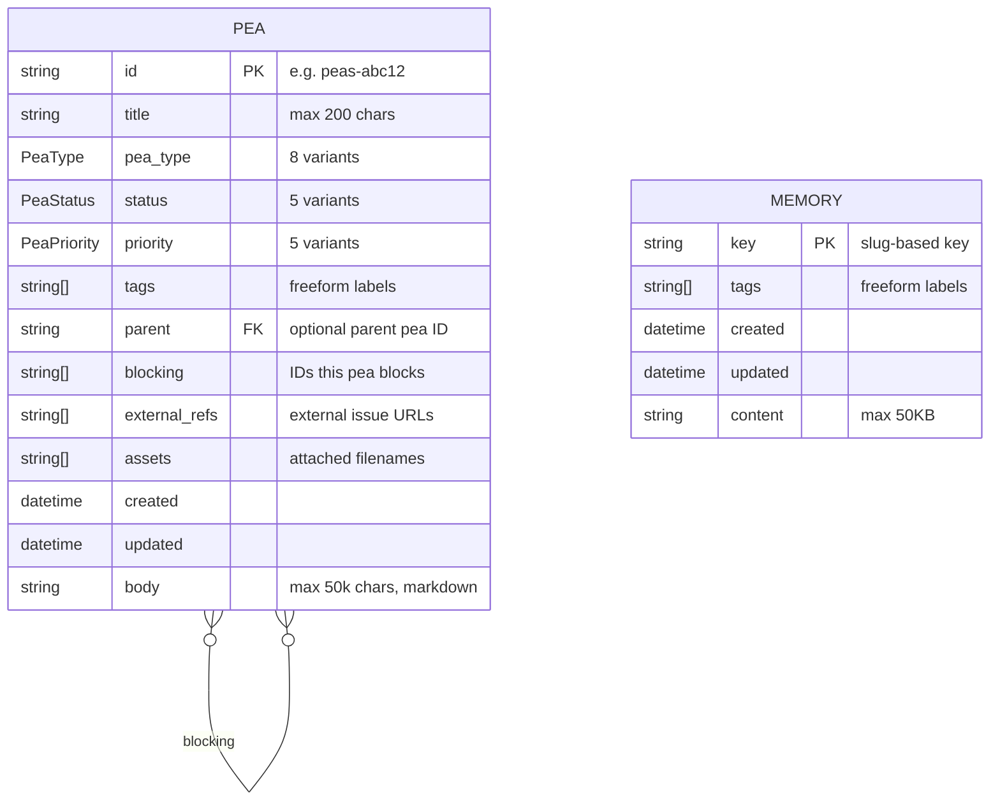
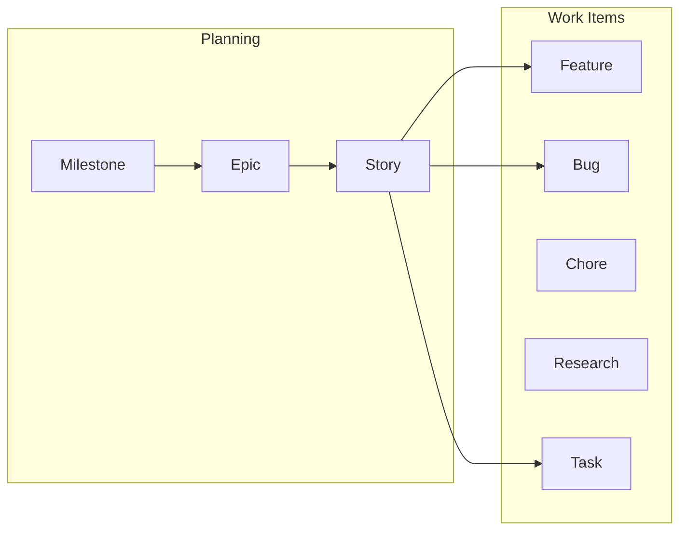
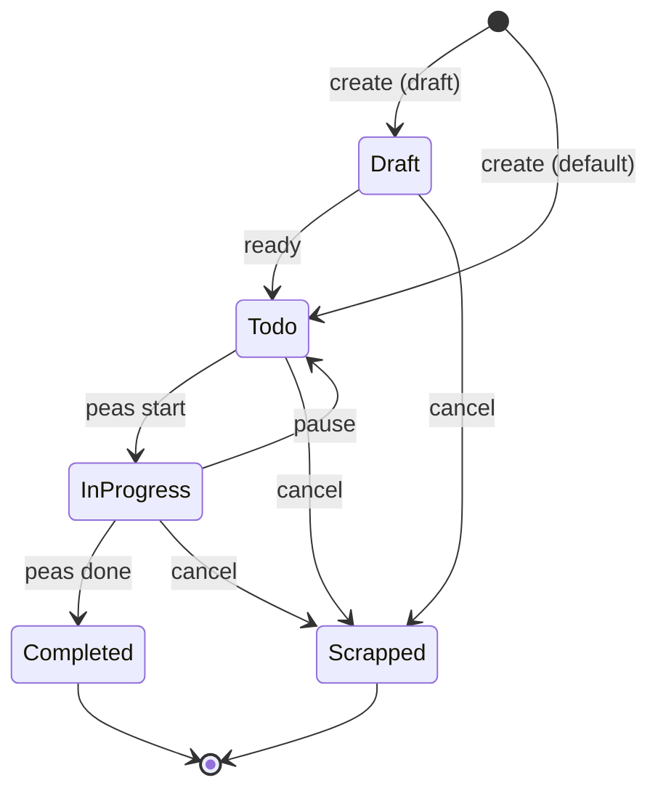

# Data Model

## Entity Relationship Diagram



## Pea Types



| Type | Description | Typical Use |
|------|-------------|-------------|
| **Milestone** | High-level project goals | Release targets, major deliverables |
| **Epic** | Large features or initiatives | Multi-sprint work packages |
| **Story** | User stories or scenarios | End-user focused requirements |
| **Feature** | New functionality | Individual capabilities to build |
| **Bug** | Issues to fix | Defects, regressions |
| **Chore** | Maintenance tasks | Refactoring, cleanup, upgrades |
| **Research** | Investigation spikes | Evaluations, proof of concepts |
| **Task** | General work items (default) | Anything that doesn't fit above |

## Status Lifecycle



| Status | Description | Aliases |
|--------|-------------|---------|
| **Draft** | Not ready for work | - |
| **Todo** | Ready to be worked on (default) | - |
| **In-Progress** | Currently being worked on | - |
| **Completed** | Done | `done` |
| **Scrapped** | Cancelled | `cancelled`, `canceled` |

## Priority Levels

| Priority | Code | Description |
|----------|------|-------------|
| **Critical** | p0 | Must be done immediately |
| **High** | p1 | Important, should be done soon |
| **Normal** | p2 | Standard priority (default) |
| **Low** | p3 | Nice to have |
| **Deferred** | p4 | Postponed indefinitely |

## Relationships

### Parent-Child
A pea can have one optional `parent`. This creates a hierarchy: Milestone > Epic > Story > Feature/Bug/Task. The parent field stores the parent's ID.

### Blocking
A pea can list other pea IDs in its `blocking` array. This means "this pea blocks those peas." The system validates against self-blocking and checks that referenced IDs exist.

### Circular Detection
Parent relationships are validated to prevent circular chains. The system walks the parent chain and rejects any assignment that would create a cycle.

## File Format

Tickets are stored as markdown with TOML frontmatter (YAML also supported):

```markdown
+++
id = "peas-abc12"
title = "Implement feature X"
type = "feature"
status = "in-progress"
priority = "high"
tags = ["backend", "api"]
parent = "peas-xyz9"
blocking = ["peas-def34"]
external_refs = []
assets = ["screenshot.png"]
created = "2024-01-15T10:30:00Z"
updated = "2024-01-15T14:22:00Z"
+++

Detailed description goes here in markdown.
```

## Directory Structure

```
.peas/
├── config.toml           Project configuration
├── peas-abc12.md         Active ticket
├── peas-xyz99.md         Active ticket
├── archive/
│   └── peas-old01.md     Archived ticket
├── memories/
│   └── auth-flow.md      Memory entry
├── assets/
│   └── peas-abc12/
│       └── screenshot.png
├── .undo                 Undo stack (JSON)
└── .id                   Sequential ID counter (if using sequential mode)
```

## Validation Rules

| Field | Rule |
|-------|------|
| Title | 1–200 characters, non-empty |
| Body | Max 50,000 characters |
| ID | Max 50 characters, no path traversal chars |
| Tag | Max 50 characters, no path traversal chars |
| Parent | Must exist, no self-reference, no circular chains |
| Blocking | Must exist, no self-reference |
| Asset path | No `..`, `/`, `\`, null bytes, URL-encoded traversal |
| Memory key | Slug format |
| Memory content | Max 50KB |
| Memory count | Max 10,000 entries per project |
