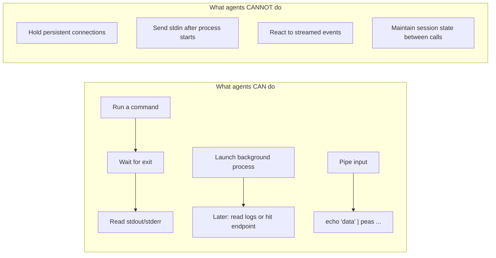
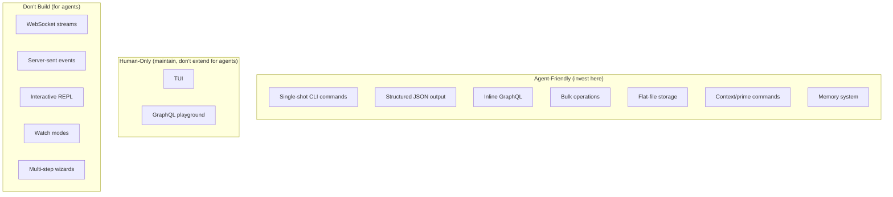

# Designing Peas for CLI-Based AI Agents

## Context

AI coding agents like Claude Code interact with tools through **discrete, stateless command-response cycles**. Understanding these constraints is essential for shaping the peas API to be maximally useful for agent integration — and for knowing what not to invest effort in.

## Agent Interaction Model



### Capabilities

| Capability | How it works |
|-----------|--------------|
| Run commands | Execute a CLI command, receive stdout/stderr on exit |
| Background processes | Start a server, then query it with separate commands |
| Piped input | `echo "data" | peas bulk create` works fine |
| One-shot HTTP | `curl`, `grpcurl`, single-exchange WebSocket tools |
| File I/O | Read/write files freely between commands |
| Parallel commands | Multiple independent commands can run concurrently |

### Hard Limitations

| Limitation | Implication |
|-----------|-------------|
| **No persistent connections** | WebSocket subscriptions, gRPC streaming, SSE — all unusable |
| **No interactive stdin** | Can't type into a running process after launch |
| **No event listeners** | Can't subscribe and react to a stream over time |
| **No session state** | Each command invocation is independent |
| **Timeout ceiling** | Commands time out at ~10 minutes max |
| **No cross-turn memory** | Agent context resets between conversation turns (unless persisted to files) |

## Design Principles for Peas

### 1. Every operation must be a single command with a definitive exit

Good:
```bash
peas create "Fix bug" -t bug          # exits with result
peas list -s in-progress              # exits with list
peas query '{ stats { total } }'      # exits with JSON
```

Bad (for agents):
```bash
peas interactive                       # REPL — agent can't interact
peas watch                             # never exits — agent hangs
peas subscribe --events status-change  # stream — agent can't consume
```

### 2. Prefer structured output over interactive flows

Agents parse stdout. Design commands to return complete, machine-readable results in one shot.

```bash
# Good: single command, complete result
peas show peas-abc12 --json

# Good: query returns everything needed
peas query '{ peas(filter: { isOpen: true }) { nodes { id title status } } }'

# Avoid: multi-step interactive wizards
peas create --interactive   # prompts for title, type, etc. — agent can't respond
```

### 3. Bulk operations via arguments and pipes, not sessions

Agents can't hold a session open to issue multiple sub-commands. Provide bulk operations as single commands:

```bash
# Good: bulk via args
peas bulk done peas-abc12 peas-def34 peas-ghi56

# Good: bulk via pipe
echo -e "Task one\nTask two\nTask three" | peas bulk create -t task

# Avoid: stateful sessions
peas session start → peas session add ... → peas session commit
```

### 4. The GraphQL server is useful, but only via one-shot queries

`peas serve` is fine — agents can start it in the background and hit it with `curl`. But don't invest in:

- WebSocket subscriptions for live updates
- Server-sent events (SSE) for change notifications  
- Long-polling endpoints
- gRPC streaming RPCs

None of these can be consumed by current CLI agents. If real-time notifications are needed, a simpler approach works: the agent re-runs `peas list` or `peas query` as needed.

### 5. The inline GraphQL commands (`peas query`, `peas mutate`) are ideal

These are the most agent-friendly pattern in the project:

```bash
# Single command, structured input, structured output, exits immediately
peas query '{ stats { total byStatus { todo inProgress } } }'
peas mutate 'setStatus(id: "peas-abc12", status: IN_PROGRESS) { id status }'
```

No server to start, no connection to manage, no session state. Keep investing here.

### 6. `peas prime` and `peas context` are high-value agent commands

These commands dump structured context that agents ingest at the start of a session. They work perfectly with the command-response model and should remain a priority.

### 7. File-based state is the universal integration mechanism

Since agents can read and write files freely, the flat-file architecture of peas is a natural fit:

- Agents can read `.peas/*.md` directly if needed
- Agents can write ticket files directly (though CLI is preferred for validation)
- The memory system (`.peas/memories/`) serves as cross-session knowledge transfer
- Undo state (`.peas/.undo`) persists between commands automatically

This is a strength — don't add database layers or in-memory-only state that would break this.

## What NOT to Build (for Agent Use)

| Feature | Why it's wasted effort |
|---------|----------------------|
| WebSocket/SSE subscriptions | Agents can't hold connections open |
| Interactive TUI modes for agents | Agents can't send keystrokes; TUI is for humans |
| REPL / shell mode | Agents can't interact with running processes |
| Watch/poll commands that don't exit | Agent would hang until timeout |
| OAuth/browser-based auth flows | Agents can't interact with browsers |
| Streaming gRPC endpoints | Agents need unary request-response |
| Multi-step wizard flows | Agents can't respond to prompts |
| Session-based APIs | Agents have no session continuity |

## What TO Invest In

| Feature | Why it's high-value |
|---------|--------------------|
| Rich CLI flags | More expressible single commands |
| JSON output (`--json`) | Machine-parseable results |
| Inline GraphQL (`query`/`mutate`) | Flexible structured queries without a server |
| Bulk commands with pipe support | Batch operations in one invocation |
| `prime`/`context` commands | Agent onboarding and context loading |
| Memory system | Cross-session knowledge for agents |
| Exit codes | Agents use these to detect success/failure |
| Idempotent operations | Safe to retry on timeout |
| Deterministic output | Agents parse stdout — keep formats stable |

## Summary



The core insight: **peas is already well-designed for agent use.** The flat-file storage, CLI-first approach, inline GraphQL, and memory system all align naturally with how CLI agents operate. The main risk is investing effort in real-time/interactive features that agents fundamentally cannot use.
