# GraphQL API

Peas exposes a full GraphQL API for programmatic access, designed for AI agent integration and automation.

## Starting the Server

```bash
peas serve --port 4000
# GraphQL playground available at http://localhost:4000
```

## Inline Execution

```bash
# Queries
peas query '{ stats { total byStatus { todo inProgress completed } } }'

# Mutations (auto-wrapped in `mutation { }`)
peas mutate 'createPea(input: { title: "New Task", peaType: TASK }) { id }'
```

## Schema Overview

```mermaid
graph TB
    subgraph QueryRoot
        Q_PEA[pea id: String!]
        Q_PEAS[peas filter limit offset]
        Q_SEARCH[search query limit]
        Q_CHILDREN[children parentId]
        Q_STATS[stats]
        Q_MEMORIES[memories filter limit]
    end

    subgraph MutationRoot
        M_CREATE[createPea]
        M_UPDATE[updatePea]
        M_STATUS[setStatus]
        M_PRIORITY[setPriority]
        M_PARENT[setParent]
        M_TAG_ADD[addTag]
        M_TAG_RM[removeTag]
        M_BLOCK_ADD[addBlocking]
        M_BLOCK_RM[removeBlocking]
        M_ARCHIVE[archivePea]
        M_DELETE[deletePea]
        M_MEM[Memory mutations]
    end

    subgraph Types
        PEA_T[Pea]
        CONN[PeaConnection]
        STATS_T[Stats]
        MEM_T[Memory]
    end

    Q_PEA --> PEA_T
    Q_PEAS --> CONN
    Q_SEARCH --> PEA_T
    Q_STATS --> STATS_T
    Q_MEMORIES --> MEM_T

    M_CREATE --> PEA_T
    M_UPDATE --> PEA_T
    M_STATUS --> PEA_T
```



## Queries

### Get a Single Pea

```graphql
{
  pea(id: "peas-abc12") {
    id
    title
    peaType
    status
    priority
    tags
    parent
    blocking
    body
    created
    updated
  }
}
```

### List Peas with Filters

```graphql
{
  peas(filter: { isOpen: true, peaType: BUG, priority: HIGH }, limit: 10) {
    nodes {
      id
      title
      status
      priority
    }
    totalCount
  }
}
```

### Search

```graphql
{
  search(query: "authentication", limit: 5) {
    id
    title
    status
  }
}
```

### Get Children

```graphql
{
  children(parentId: "peas-epic1") {
    id
    title
    peaType
    status
  }
}
```

### Project Statistics

```graphql
{
  stats {
    total
    byStatus {
      draft
      todo
      inProgress
      completed
      scrapped
    }
    byType {
      feature
      bug
      task
      epic
    }
    byPriority {
      critical
      high
      normal
      low
      deferred
    }
  }
}
```

### List Memories

```graphql
{
  memories(filter: { tag: "architecture" }, limit: 20) {
    nodes {
      key
      tags
      content
      created
      updated
    }
    totalCount
  }
}
```

## Mutations

### Create a Pea

```graphql
mutation {
  createPea(input: {
    title: "Implement OAuth2"
    peaType: FEATURE
    priority: HIGH
    tags: ["auth", "security"]
    parent: "peas-epic1"
    body: "Add OAuth2 support for third-party login."
  }) {
    id
    title
    status
  }
}
```

### Update a Pea

```graphql
mutation {
  updatePea(id: "peas-abc12", input: {
    title: "Updated title"
    tags: ["new-tag"]
    body: "Updated description"
  }) {
    id
    title
    updated
  }
}
```

### Set Status / Priority

```graphql
mutation {
  setStatus(id: "peas-abc12", status: IN_PROGRESS) { id status }
}
```

```graphql
mutation {
  setPriority(id: "peas-abc12", priority: CRITICAL) { id priority }
}
```

### Manage Relationships

```graphql
mutation {
  setParent(id: "peas-task1", parentId: "peas-epic1") { id parent }
}

mutation {
  addBlocking(id: "peas-abc12", blockedId: "peas-def34") { id blocking }
}

mutation {
  removeBlocking(id: "peas-abc12", blockedId: "peas-def34") { id blocking }
}
```

### Manage Tags

```graphql
mutation {
  addTag(id: "peas-abc12", tag: "urgent") { id tags }
}

mutation {
  removeTag(id: "peas-abc12", tag: "urgent") { id tags }
}
```

### Archive / Delete

```graphql
mutation {
  archivePea(id: "peas-abc12", recursive: true) { id }
}

mutation {
  deletePea(id: "peas-abc12")
}
```

## Query Limits

| Constraint | Value |
|-----------|-------|
| Max query depth | 10 |
| Max query complexity | 500 |

These limits prevent expensive recursive queries from overloading the server.

## Enum Values

### PeaType
`MILESTONE`, `EPIC`, `STORY`, `FEATURE`, `BUG`, `CHORE`, `RESEARCH`, `TASK`

### PeaStatus
`DRAFT`, `TODO`, `IN_PROGRESS`, `COMPLETED`, `SCRAPPED`

### PeaPriority
`CRITICAL`, `HIGH`, `NORMAL`, `LOW`, `DEFERRED`
