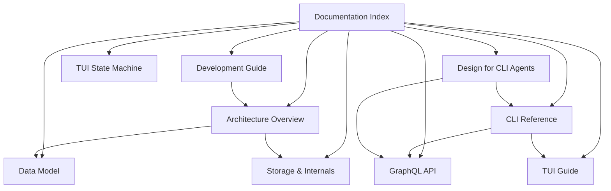

# Peas Documentation

**Peas** is a CLI-based, flat-file issue tracker for humans and robots. It stores issues as markdown files with TOML frontmatter in a `.peas/` directory alongside your code.

## Documentation Map

## Guides

| Document | Description |
|----------|-------------|
| [Architecture Overview](architecture.md) | System design, module structure, data flow, and key design decisions |
| [Data Model](data-model.md) | Entity relationships, types, statuses, priorities, validation rules |
| [CLI Reference](cli-reference.md) | Complete command reference with flags and examples |
| [GraphQL API](graphql-api.md) | Schema, queries, mutations, and usage examples |
| [Storage & Internals](storage-and-internals.md) | File format, caching, undo system, search engine, security |
| [TUI Guide](tui-guide.md) | Interactive terminal UI: layout, shortcuts, and features |
| [TUI State Machine](tui-state-machine.md) | Detailed state machine diagram, transitions, and invariants |
| [Design for CLI Agents](design-for-cli-agents.md) | Interaction model constraints, what to build vs. avoid for agent use |
| [Development Guide](development.md) | Building, testing, dependencies, and contributing |

## Quick Links

- **Getting started**: See the [README](../README.md) for installation and quick start
- **All commands**: [CLI Reference](cli-reference.md)
- **How it works**: [Architecture](architecture.md) → [Storage & Internals](storage-and-internals.md)
- **Data structures**: [Data Model](data-model.md)
- **API access**: [GraphQL API](graphql-api.md)
- **Interactive use**: [TUI Guide](tui-guide.md)
- **Contributing**: [Development Guide](development.md)

## Feature Highlights

- **No database** — tickets are markdown files, version-controlled with git
- **Three interfaces** — CLI, GraphQL API, and interactive TUI
- **Hierarchical tickets** — milestones, epics, stories, features, bugs, chores, research, tasks
- **Relationships** — parent-child hierarchy and blocking dependencies
- **Memory system** — persistent knowledge base for project context
- **Asset management** — attach files to tickets with validation
- **Multi-level undo** — 50-operation undo stack
- **Advanced search** — substring, field-specific, and regex queries
- **Agent-friendly** — designed for AI coding agent integration
- **Bulk operations** — create, update, and tag multiple tickets at once
