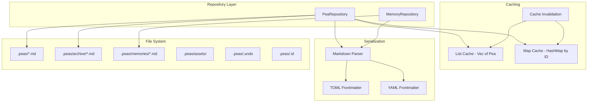
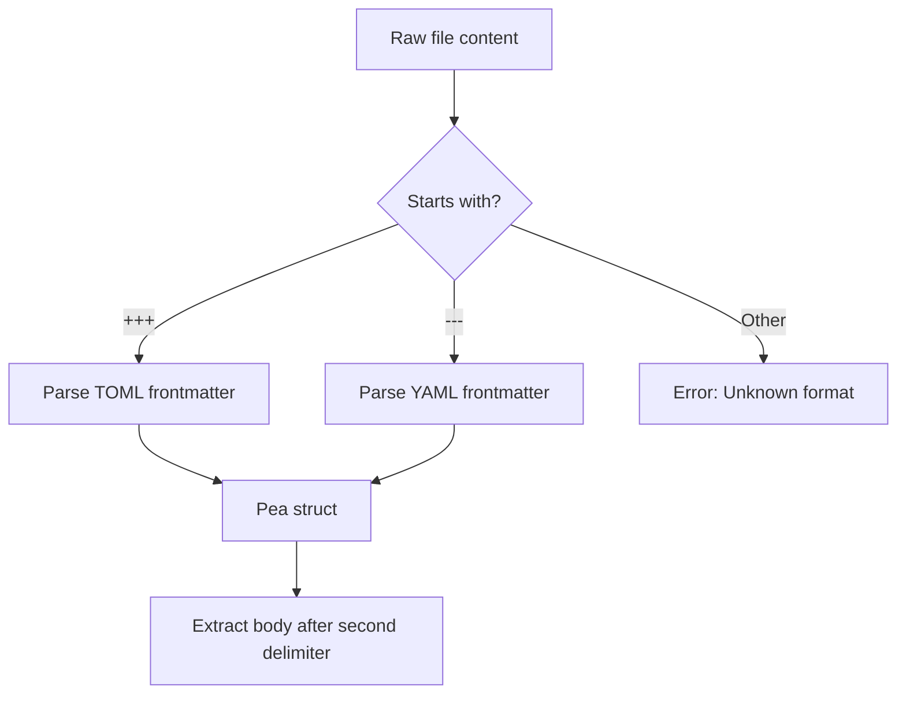
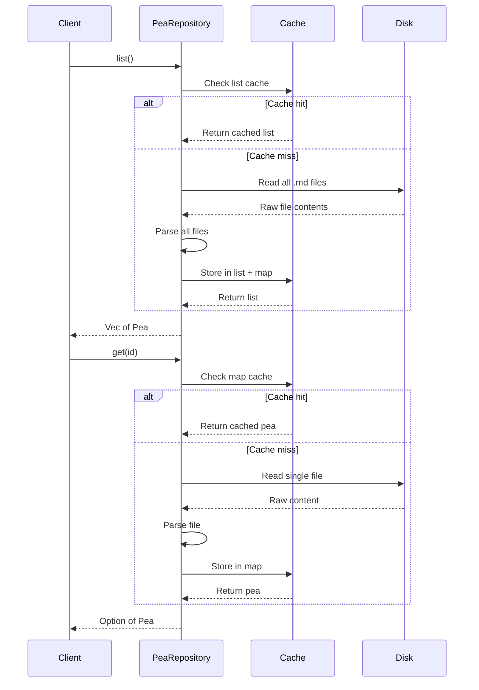
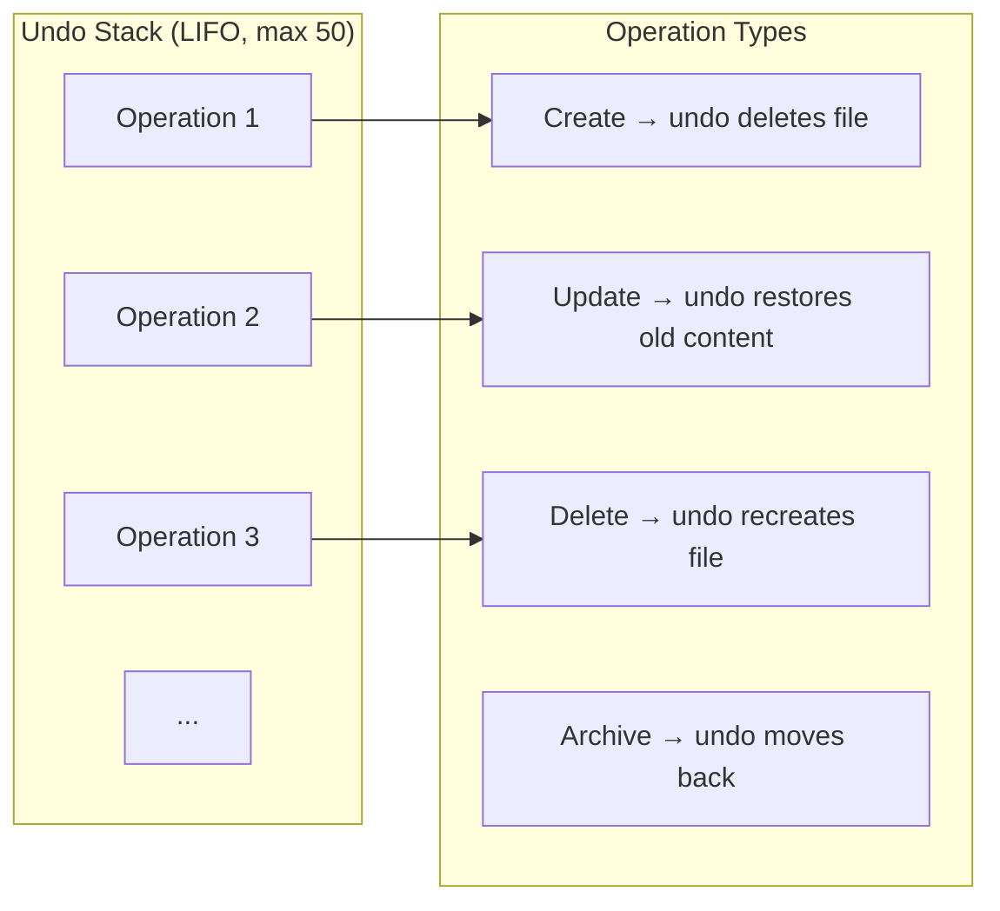
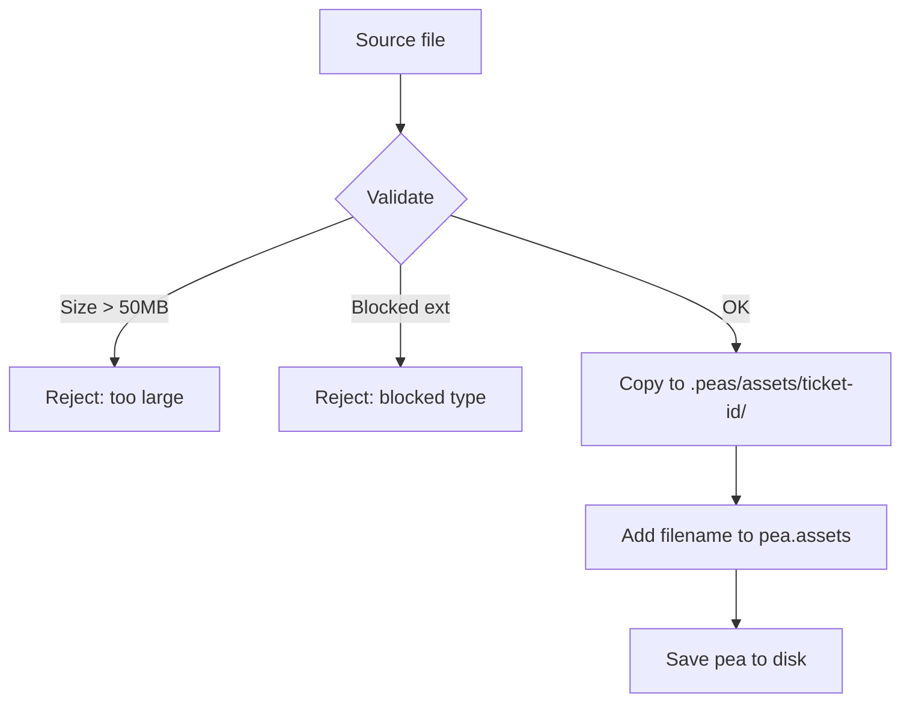
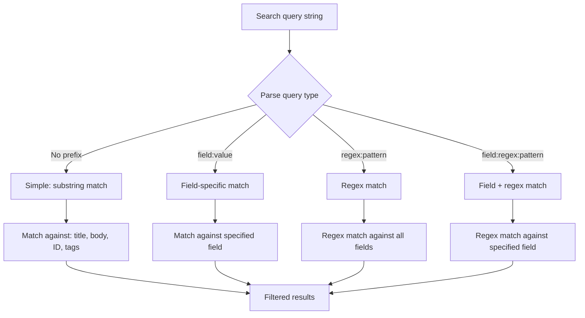
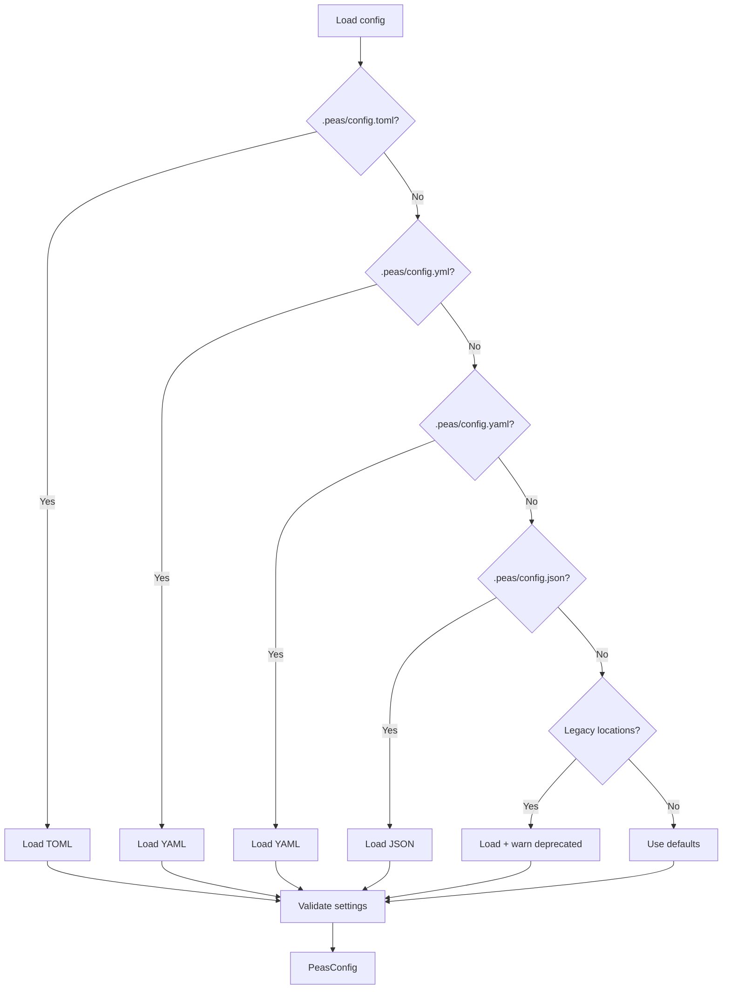

# Storage & Internals

## Storage Architecture

## File Format Parsing

The markdown parser (`storage/markdown.rs`) auto-detects frontmatter format:

When writing, the configured format (`config.toml` → `frontmatter = "toml"` or `"yaml"`) determines the output format.

## ID Generation

Two modes are available, configured in `config.toml`:

### Random Mode (default)
- Uses `nanoid` with alphanumeric charset
- Format: `{prefix}{random}` (e.g., `peas-a1b2c`)
- Configurable prefix (default: `peas-`) and length (default: 5)
- Collision-resistant for typical project sizes

### Sequential Mode
- Format: `{prefix}{padded_number}` (e.g., `peas-00001`)
- Counter stored in `.peas/.id`
- Padded to `id_length` digits
- Monotonically increasing

## Caching Strategy

Cache invalidation occurs on:
- Any write operation (create, update, delete, archive)
- External file changes detected by the TUI file watcher

## Undo System

Each operation records:
- **Type**: create, update, delete, or archive
- **File path**: Location of the affected file
- **Previous content**: For updates, the file content before the change
- **Timestamp**: When the operation occurred

The stack is persisted as JSON in `.peas/.undo`.

## Asset Management

**Blocked extensions**: `exe`, `dll`, `so`, `dylib`, `bat`, `cmd`, `sh`, `bash`, `ps1`, `js`

Assets are stored in `.peas/assets/{ticket-id}/{filename}` and referenced by filename in the pea's `assets` array.

## Search Engine

All searches are case-insensitive except regex (which follows the pattern's flags).

## Configuration Resolution

Legacy locations (`.peas.toml`, `.peas.yml`, etc. in project root) are supported but deprecated. Run `peas doctor --fix` or `peas migrate` to move to the canonical location.

## Security Measures

### Path Traversal Prevention
All file paths are validated against:
- Directory traversal (`..`)
- Absolute paths (`/`, `\`)
- Null bytes
- URL-encoded variants (`%2f`, `%5c`, `%2e%2e`)
- Path containment (output must stay within `.peas/`)

### Input Sanitization
- Title: max 200 characters
- Body: max 50,000 characters
- ID: max 50 characters, restricted charset
- Tag: max 50 characters, restricted charset
- Memory: max 50KB content, max 10,000 entries

### Asset Safety
- Maximum file size: 50MB
- Blocked executable extensions
- Files copied (not linked) to prevent external mutation
