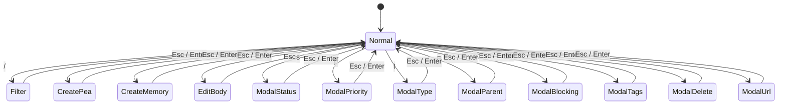

# TUI User Guide

The Peas TUI is a modal terminal interface for browsing and managing tickets interactively. Launch it with `peas tui`.

## Layout

```
┌─────────────────────────────────────────────────────────────┐
│  Peas TUI                              [Tickets] [Memory]  │
├──────────────────────────┬──────────────────────────────────┤
│  Ticket List             │  Detail Pane                     │
│                          │                                  │
│  ▸ [M] Q1 Release        │  Body / Relations / Assets /    │
│    [E] Auth System        │  Metadata                       │
│      [F] OAuth Login      │                                  │
│      [B] Fix CSRF bug     │  (content of selected ticket)   │
│    [T] Update README      │                                  │
│                          │                                  │
├──────────────────────────┴──────────────────────────────────┤
│  Status bar: mode, selected count, filter                   │
└─────────────────────────────────────────────────────────────┘
```

## Views

The TUI has two main views, toggled with `Tab`:

- **Tickets**: Hierarchical tree view of all peas, organized by parent-child relationships
- **Memory**: List of memory entries with key, tags, and content preview

## State Machine



## Keyboard Shortcuts

### Normal Mode

| Key | Action |
|-----|--------|
| `j` / `↓` | Move down |
| `k` / `↑` | Move up |
| `←` / `→` | Previous / next page |
| `g` / `G` | Jump to top / bottom |
| `PageUp` / `PageDown` | Page up / down |
| `Tab` | Switch Tickets / Memory view |
| `Space` | Toggle multi-select |
| `1` `2` `3` `4` | Switch detail pane (Body, Relations, Assets, Metadata) |
| `h` / `l` | Scroll detail pane left / right |
| `Ctrl+U` / `Ctrl+D` | Scroll detail pane up / down |
| `Enter` | Open detail view |
| `r` | Refresh from disk |
| `?` | Toggle help overlay |
| `q` | Quit |

### Actions (from Normal Mode)

| Key | Action |
|-----|--------|
| `/` | Enter search/filter mode |
| `c` | Create new ticket |
| `m` | Create new memory |
| `e` | Edit ticket body |
| `s` | Change status |
| `p` | Change priority |
| `t` | Change type |
| `P` | Set parent |
| `b` | Set blocking tickets |
| `T` | Edit tags |
| `d` | Delete ticket (with confirmation) |
| `u` | Undo last operation |

### Modal Navigation

All modals share these controls:

| Key | Action |
|-----|--------|
| `j` / `↓` | Next option |
| `k` / `↑` | Previous option |
| `Enter` | Apply selection |
| `Esc` | Cancel and close |

### Filter Mode

| Key | Action |
|-----|--------|
| Type text | Update filter query |
| `Enter` | Apply filter |
| `Esc` | Clear filter and return |

### Edit Body Mode

A multi-line text editor for the ticket body. Standard text editing keys apply. Press `Esc` to save and close.

## Detail Panes

When a ticket is selected, the right panel shows one of four detail panes:

1. **Body** (key `1`): The ticket's markdown body/description
2. **Relations** (key `2`): Parent ticket and blocking relationships visualized
3. **Assets** (key `3`): List of attached files
4. **Metadata** (key `4`): Status, priority, type, tags, timestamps, external refs

## Multi-Select

Press `Space` to toggle selection on individual tickets. Selected tickets are highlighted. Bulk actions (status changes, tagging) apply to all selected tickets.

## Concurrent Edit Detection

The TUI watches for file changes on disk. If a ticket is modified externally (by CLI, another TUI instance, or manual edit), the TUI detects the change and prompts for refresh, preventing lost updates.

## Tree View

Tickets are displayed in a hierarchical tree based on parent-child relationships:

```
▸ [Milestone] Q1 Release
  ├─ [Epic] Authentication
  │  ├─ [Feature] OAuth2 Login
  │  ├─ [Bug] Fix CSRF Token
  │  └─ [Task] Write Auth Tests
  └─ [Epic] Dashboard
     └─ [Feature] Analytics Widget
[Task] Update README (no parent)
```

Tickets without parents appear at the root level. The tree supports pagination for large projects.
